# 🚀 AI Pocket Projects: Your Journey to Building Intelligent Systems

> *From zero to AI product in weeks, not months*

**AI Pocket Projects** is your guided journey through building real AI systems that people actually use. Instead of toy examples, you'll build production-ready components that solve genuine problems: intelligent search, natural voice interfaces, and knowledge systems that get smarter over time.

## 🎯 The Journey Ahead

Building AI products can feel overwhelming. Where do you start? How do you move beyond tutorials to systems that handle real users, real data, and real problems?

This repository takes you on a structured journey through three interconnected projects that, together, form the foundation of modern AI applications:

```
🧠 Knowledge Layer (RAG) → 🗣️ Voice Interface → 🌐 Live Information
```

Each project builds essential skills while creating something genuinely useful. By the end, you'll have built a complete AI assistant that can:
- **Answer questions from your documents with mandatory citations**
- Have natural voice conversations
- **Search the web and incorporate fresh information with source attribution**
- Learn from every interaction
---

## 🗺️ Your Learning Path

### **Phase 1: The Knowledge Foundation**
*Build a system that understands and remembers*

**Project: RAG (Retrieval-Augmented Generation)**

Every AI product needs to work with information. RAG teaches you to build systems that can:
- Ingest and understand documents (PDFs, web pages, notes)
- **Answer questions with mandatory source citations** - never respond without attribution
- Remember conversations and learn from them
- Evaluate and improve their own performance

**What you'll learn:**
- Vector databases and semantic search
- Chunking strategies for different content types
- **Prompt engineering for reliable outputs with source attribution**
- **Citation tracking and verification systems**
- Building evaluation systems that catch problems early
- **Using Langfuse for prompt experimentation and LLM-as-a-judge evaluation**

**Strech**
= Explore knowldege graphs (neo4j). There are a select type of question vector dbs cannot store. 
- Where does memory fit in? Store what when where?

**Real-world applications:**
- Customer support bots that know your product docs
- BizOps Agents - Research, Sales Enablement, Deep Research
  + Do you scale 1 agent per process, or 1 agnet that routes to a collection of related processes?

---

### **Phase 2: The Voice Revolution**
*Make AI feel natural and immediate*

**Project: Voice Layer with Real-Time Conversation**

Text is powerful, but voice changes everything. You'll build a system that feels like talking to a knowledgeable friend.

**🎙️ See it in action:** [AI Operator Demo](https://www.youtube.com/watch?v=iPqDASo2gsQ)

**📚 Full implementation:** [github.com/Kode-Rex/ai-operator](https://github.com/Kode-Rex/ai-operator)

**What you'll build:**
- Real-time speech-to-text with interruption handling
- Natural conversation flow with context awareness
- High-quality text-to-speech that sounds human
- Web interface for seamless interaction

**What you'll learn:**
- **Pipecat framework** for low-latency voice pipeline orchestration
- **OpenAI Realtime API** for low-latency voice interactions
- WebSocket streaming for real-time communication
- Audio processing and voice activity detection
- Multi-service architecture (Deepgram + OpenAI + Cartesia)
- Handling interruptions and conversation state

**Real-world applications:**
- Voice assistants for accessibility
- Hands-free interfaces for mobile/automotive
- Interactive learning and training systems

---

### **Phase 3: The Living Web**
*Connect your AI to the world's information*

**Project: Web MCP (Model Context Protocol) Server**

Static knowledge isn't enough. Your AI needs to search, discover, and incorporate fresh information from the web.

**🔍 Full implementation:** [github.com/Kode-Rex/webcat](https://github.com/Kode-Rex/webcat)

**What you'll build:**
- MCP server that follows emerging standards
- Intelligent web search with result ranking
- Clean content extraction from any webpage
- **Automatic knowledge base updates with full source attribution**

**What you'll learn:**
- Model Context Protocol (MCP) implementation
- Web scraping that respects robots.txt and rate limits
- Content cleaning and markdown conversion
- Building extensible tool systems

**Real-world applications:**
- Research assistants that stay current
- Customer service bots with live product info
- Content creation tools with fact-checking

---

## 🏗️ Architecture: How It All Connects

```mermaid
graph TB
    User[👤 User] --> Voice[🎙️ Voice Interface]
    User --> Web[🌐 Web UI]
    
    Voice --> RAG[🧠 RAG System]
    Web --> RAG
    
    RAG --> VectorDB[(📊 Vector Database)]
    RAG --> LLM[🤖 Language Model]
    
    MCP[🔍 Web MCP Server] --> RAG
    MCP --> Search[🔎 Search APIs]
    MCP --> Scraper[📄 Web Scraper]
    
    RAG --> Memory[(💾 Conversation Memory)]
    RAG --> Eval[📈 Evaluation System]
```



Each component is designed to work independently or as part of the larger system. Start with one, master it, then connect the pieces.

---

## 📁 Project Structure

```
AI-Pocket-Projects/
├── README.md                    # This guide
├── data/
│   └── corpus/                  # RAG materials
│       ├── ai/                  # AI concepts and techniques
│       └── computing/           # Computing history and context
└── project/                     # Structured learning phases
    ├── 1. RAG/
    │   └── README.md           # Phase 1: Knowledge Foundation guide
    ├── 2. Voice/
    │   └── README.md           # Phase 2: Voice Interface guide
    └── 3. MCP/
        └── README.md           # Phase 3: Web Search guide
```

---

## 🛠️ Tech Stack & Tools

**Languages & Frameworks:**
- **Python**: FastAPI, pytest for backend systems
- **JavaScript/TypeScript**: Modern web interfaces and MCP servers
- **SQL**: SQLite for simple, reliable data storage
- **Pipecat**: Voice pipeline framework for real-time conversations

**AI & ML Services:**
- **OpenAI GPT-4o**: Language understanding and generation
- **OpenAI Realtime API**: Low-latency voice conversations
- **Deepgram**: Real-time speech recognition
- **Cartesia**: High-quality text-to-speech
- **Various embedding models**: For semantic search
- **Langfuse**: Prompt playground, evaluations, and LLM-as-a-judge monitoring

**Infrastructure:**
- **Docker**: Consistent development environments
- **WebSockets**: Real-time communication
- **Vector databases**: Chroma, SQLite-vec for semantic search

---

## 🤖 AI-Assisted Development: Your Learning Accelerator

**Don't code alone—code with AI!** This project is designed to be explored with AI development tools like GitHub Copilot, Claude, ChatGPT, or Cursor. Here's how to maximize your learning:

### **🔍 Exploration Strategies**
- **Ask "What if?"** questions: "What if I used a different embedding model?" "How would this work with streaming data?"
- **Request explanations**: Paste code snippets and ask your AI assistant to explain the architecture decisions
- **Generate variations**: "Show me 3 different ways to implement this chunking strategy"
- **Debug together**: When something breaks, describe the error to your AI assistant for faster troubleshooting

### **💡 Learning Prompts to Try**
```
"Explain this RAG pipeline like I'm a senior developer new to AI"
"What are the trade-offs between these vector database choices?"
"Help me refactor this code to be more production-ready"
"What edge cases should I test for in this voice processing pipeline?"
```

### **🛠️ AI Tools That Pair Well**
- **GitHub Copilot**: Autocomplete and code suggestions as you build
- **Cursor**: AI-powered IDE with codebase understanding
- **Claude/ChatGPT**: Architecture discussions and code reviews
- **Codeium**: Free alternative with good Python/JS support
- **Langfuse**: Prompt playground for experimentation and LLM monitoring

### **🎯 Pro Tips for AI-Assisted Learning**
1. **Start with questions**: Before writing code, ask your AI assistant to explain the approach
2. **Iterate rapidly**: Use AI to generate multiple implementation options, then choose the best
3. **Learn by teaching**: Ask AI to help you explain concepts back—great for retention
4. **Challenge assumptions**: "Is this the best way to do X?" often leads to better solutions

**Remember**: AI is your pair programming partner, not a replacement for understanding. Use it to accelerate learning, not skip it!

---

## 🚀 Getting Started

This repository is a **learning guide and architecture blueprint** - not a ready-to-run codebase. You'll build these systems step-by-step following the structured learning path below.

### **What's Here Now**
- 📚 **Comprehensive learning materials** in the `data/corpus/` directory
- 🗺️ **Detailed project roadmaps** and architectural guidance
- 🔗 **Working examples** in the referenced repositories:
  - [AI Operator](https://github.com/Kode-Rex/ai-operator) - Complete voice conversation system
  - [WebCat](https://github.com/Kode-Rex/webcat) - MCP server for web search and scraping

### **Your Learning Journey**
1. **Start with the knowledge base**: Explore the AI and computing materials in `data/corpus/`
2. **Study the working examples**: Clone and experiment with AI Operator and WebCat
3. **Follow the 8-week roadmap**: Build your own implementations using the milestones below
4. **Use AI-assisted development**: Leverage the tools and prompts suggested above

### **Prerequisites for Building**
- **Python 3.9+** and **Node.js 18+** for development
- **API Keys**: OpenAI, Deepgram, Cartesia (for voice features)
- **AI Development Tools**: GitHub Copilot, Cursor, or Claude for assistance
- **Langfuse Account**: For prompt experimentation and evaluation

### **Recommended First Steps**
1. **Read the learning materials**: Start with [RAG Introduction](data/corpus/ai/rag_intro.md)
2. **Clone the working examples**: Study how AI Operator implements voice conversations
3. **Set up your development environment**: Install Python, Node.js, and your preferred AI coding assistant
4. **Begin Phase 1**: Follow the detailed guide in [`project/1. RAG/README.md`](project/1.%20RAG/README.md)

## 🎯 6-Week Project Milestones

### **Week 1-2: RAG Knowledge Foundation**
- [ ] Set up RAG with sample documents from corpus
- [ ] Implement basic question-answering with vector search
- [ ] **Add mandatory citation tracking - no response without sources**
- [ ] **Integrate Langfuse for prompt experimentation and monitoring**
- [ ] Create evaluation dataset with citation verification
- [ ] **Set up LLM-as-a-judge evaluation pipeline**
- [ ] Achieve >75% accuracy on test questions with 100% citation compliance

### **Week 3-4: Voice Integration**
**📚 Working Example:** [AI Operator](https://github.com/Kode-Rex/ai-operator) - Complete voice conversation system

- [ ] Set up Pipecat voice pipeline with OpenAI Realtime API
- [ ] Connect voice interface to your RAG system
- [ ] Build web interface for voice interaction
- [ ] Add interruption handling and conversation flow
- [ ] Optimize for <1.5s response time with cited voice responses

### **Week 5-6: Web Intelligence & Integration**
**📚 Working Example:** [WebCat](https://github.com/Kode-Rex/webcat) - MCP server for web search and scraping

- [ ] Deploy MCP server for web search and scraping
- [ ] **Connect web search to RAG system with source URL tracking**
- [ ] **Add automatic knowledge updates with full web citation metadata**
- [ ] Handle rate limits, errors, and edge cases gracefully
- [ ] Polish end-to-end system: Voice → RAG → Web Search → Cited Responses

---

## 🤝 Community

### **Contribute**
- 📖 **Documentation**: Improve guides and tutorials
- 💡 **Ideas**: Suggest new projects or improvements

### **Showcase Your Work**
Built something cool with these projects? We'd love to see it! Submit a showcase PR.

---

## 📄 License

MIT License - feel free to use these projects as the foundation for your own AI products.

---

*Ready to build the future? Start with `git clone` and let's go! 🚀*
